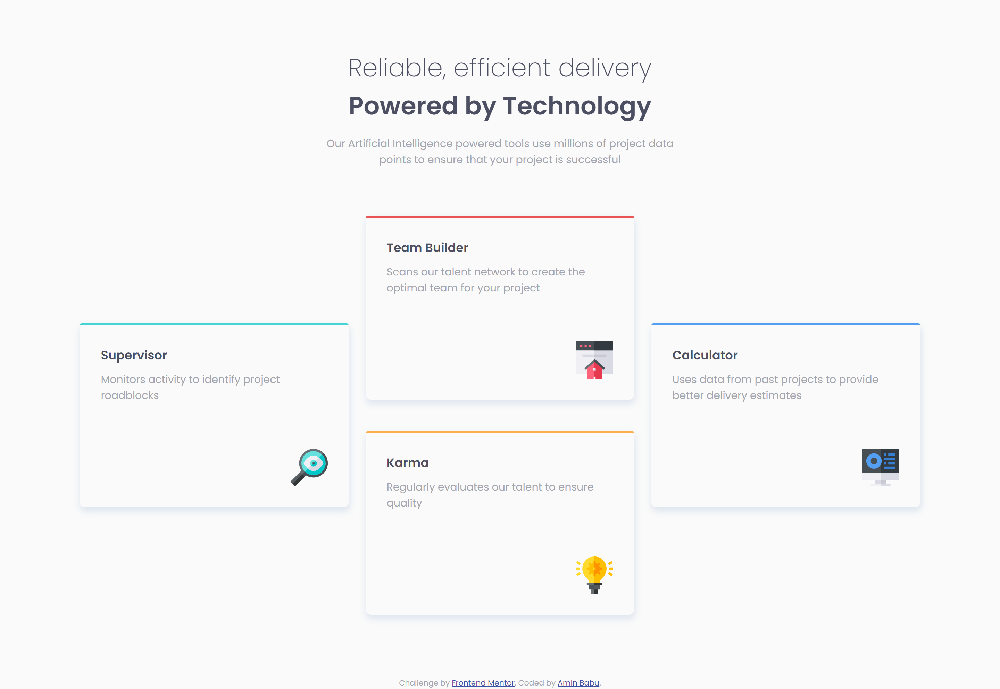
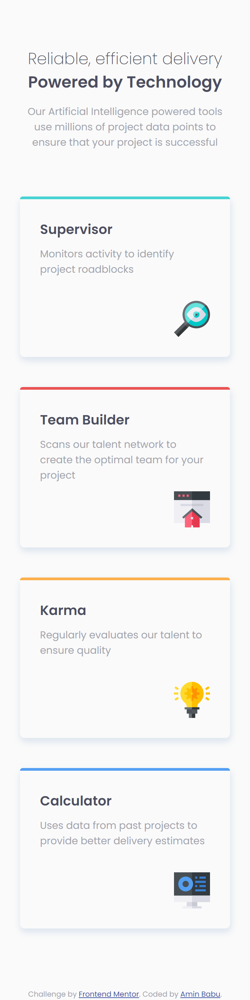

# Frontend Mentor - Four card feature section solution

This is a solution to the [Four card feature section challenge on Frontend Mentor](https://www.frontendmentor.io/challenges/four-card-feature-section-weK1eFYK). Frontend Mentor challenges help you improve your coding skills by building realistic projects. 

## Table of contents

- [Overview](#overview)
  - [Goal](#goal)
  - [Screenshot](#screenshot)
  - [Links](#links)
- [My process](#my-process)
  - [Built with](#built-with)
  - [What I learned](#what-i-learned)
- [Author](#author)

## Overview

### Goal

Users would be able to:

- View the optimal layout for the site depending on their device's screen size

### Screenshot

### Links

- Solution URL: [Solution URL here](https://github.com/aminbabu/components/tree/master/four-card-feature-section)
- Live Site URL: [Live site URL here](https://aminbabu.github.io/components/four-card-feature-section)

## My process

### Built with

- Semantic HTML5 markup
- CSS custom properties
- CSS Grid
- Mobile-first workflow

### What I learned

I have learned a lot about CSS grid system. Truly, once you could catch the flow of grid system, it will blow your mind.

## Author

- Website - [Amin Babu](#)
- Frontend Mentor - [@aminbabu](https://www.frontendmentor.io/profile/aminbabu)
- Twitter - [@AminBabu_](https://www.twitter.com/AminBabu_)