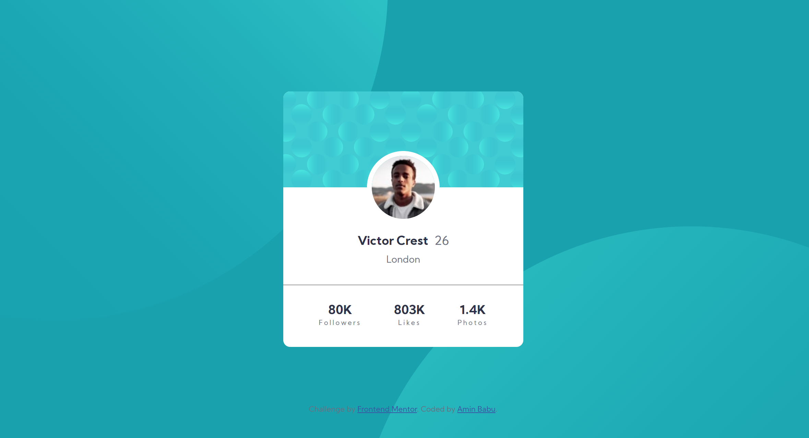
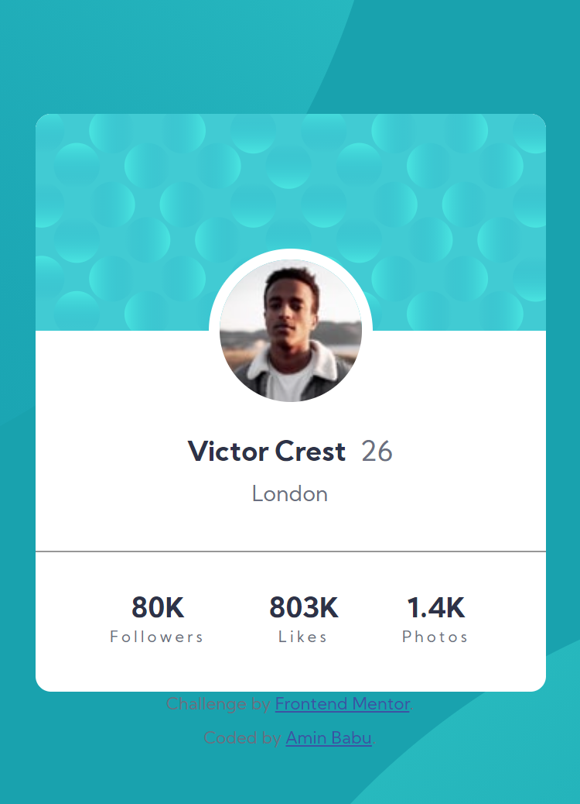

# Frontend Mentor - Profile card component solution

This is a solution to the [Profile card component challenge on Frontend Mentor](https://www.frontendmentor.io/challenges/profile-card-component-cfArpWshJ). Frontend Mentor challenges help you improve your coding skills by building realistic projects.

## Table of contents

- [Overview](#overview)
  - [Goal](#goal)
  - [Screenshot](#screenshot)
  - [Links](#links)
- [My process](#my-process)
  - [Built with](#built-with)
- [Author](#author)

## Overview

### Goal

- Build out the card project responsive over all devices

### Screenshot

### Links

- Solution URL: [GitHub Repo.](https://github.com/aminbabu/FrontendMentorChallenges/tree/master/components/profile-card)
- Live Site URL: [GitHub Page](https://aminbabu.github.io/FrontendMentorChallenges/components/profile-card)

## My process

### Built with

- Semantic HTML5 markup
- CSS custom properties
- Flexbox
- Mobile-first workflow

## Author

- Website - [Amin Babu](#)
- Frontend Mentor - [@aminbabu](https://www.frontendmentor.io/profile/aminbabu)
- Twitter - [@AminBabu_](https://www.twitter.com/AminBabu_)
