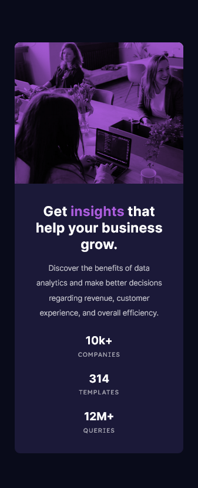

# Frontend Mentor - Stats preview card component solution

This is a solution to the [Stats preview card component challenge on Frontend Mentor](https://www.frontendmentor.io/challenges/stats-preview-card-component-8JqbgoU62). Frontend Mentor challenges help you improve your coding skills by building realistic projects.

## Table of contents

- [Overview](#overview)
  - [About the challenge](#about-the-challenge)
  - [Screenshot](#screenshot)
  - [Links](#links)
- [My process](#my-process)
  - [Built with](#built-with)
  - [What I learned](#what-i-learned)
  - [Continued development](#continued-development)
  - [Useful resources](#useful-resources)
- [Author](#author)

## Overview

### About the challenge

Users will be able to:

- View the optimal layout depending on their device's screen size

### Screenshot




### Links

- Solution URL: [GitHub Repo.](https://github.com/aminbabu/FrontendMentorChallenges/tree/master/components/stats-preview-card-component)
- Live Site URL: [GitHub Page](https://aminbabu.github.io/FrontendMentorChallenges/components/stats-preview-card-component)

## My process

### Built with

- Well Structured HTML5 markup
- CSS custom properties
- Flexbox
- CSS Grid
- Mobile-first approch workflow

### What I learned

Through this project I've learned mobile-fisrt design approch, working style of CSS flexbox and a little bit of grid system and their properties and obviously image blend mode as well. Most important fact, I want to mention that rem is better than percentage or viewport measurement.

To center any element inside a section you can add code snippet, see below:

```css
section {
  display: gird;
  place-items: center;
}
```

### Continued development

In future I will try to learn more about image positioning in any particular section.

### Useful resources

- [MDN Docs](https://developer.mozilla.org/en-US/) - This helped me to blend image with the background color. I really like this docs and will use it going forward.

## Author

- Website - [Amin Babu](#)
- Frontend Mentor - [@aminbabu](https://www.frontendmentor.io/profile/aminbabu)
- Twitter - [@AminBabu_](https://www.twitter.com/AminBabu_)
